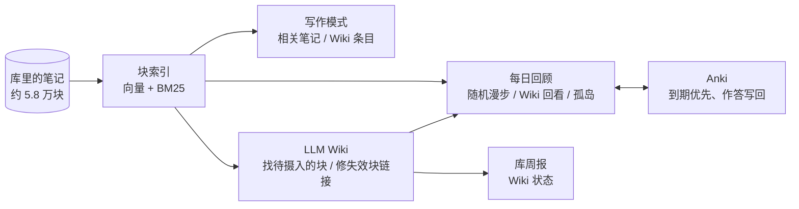

# 第二大脑（自用）

插件 ID：`second-brain`

一个跑在本机的**语义检索层**：把整个库切成块，用本地向量模型和 BM25 建索引。写作模式、LLM Wiki、Anki 复习、每日回顾和库周报都从这里取「和这段意思相近的内容」。

所有计算都在本机完成：向量由 Ollama 上的 EmbeddingGemma 算，日记和笔记不出这台电脑。



## 它连起了什么

| 连接 | 第二大脑提供的 | 对方提供的 |
| -- | -- | -- |
| **写作模式** | 跟着光标所在段落，实时列出库里意思相近的块 | Claudian（右上）陪写 |
| **LLM Wiki** | `semanticBlocks()`：按意思挑出「待摄入」的块；体检时按内容找回失效块链接的原块 | 整理好、带出处的 Wiki 条目，用在写作模式、每日回顾和周报里 |
| **稿件台** | `searchExtra()`：在主库里按意思找候选段落（单库写作时搜本库，在旧稿子库里搜外部素材库），给填坑、概念锚点检索、表达候选用；写作模式面板接上稿件台的四个下拉按钮 | 按写作步骤组织的改写、补料、追问工具 |
| **Anki** | 随机漫步里复习卡片和挖空，作答直接写进 Anki 的排程（FSRS） | 卡片状态：新卡 / 到期 / 还有几天 |
| **每日回顾 / 库周报** | 回顾：随机漫步、Wiki 回看、孤岛笔记；周报：库的变化统计 | — |

## 写作模式

- 打开要写的那篇，点左侧 ✍️ 或运行命令「写作模式：开 / 关」。会收起左栏，打开 Claudian 和「相关笔记」面板，退出时恢复原样。
- 面板顶上的「🧰 文本工具」在稿子右边分屏打开 My Text Tools 工作台（输入框带上这篇）。工作台收进写作模式里：左侧栏不再单独放它的图标，退出写作模式时一起关掉；重启 Obsidian 时上次留下的工作台和相关笔记面板也会收掉，不会一打开库就冒出来。
- 面板跟着光标走：光标所在的列表项（连同子项）或段落就是查询，每 1.5 秒看一眼有没有变。
- **📚 Wiki 栏**：LLM Wiki 整理好的条目单列在最前，最多 3 条，标着有几条出处。
  - 「↪ 链出处」「❝ 引用」用的是条目后面括号里**原笔记的块链接**，而不是 wiki 页这个二手转述。
  - 没有出处的条目（多半是通识补充）会注明「wiki 整理，无原笔记出处」。
- **📝 笔记栏**：其余相近的块，可以插入链接或引用。用过的素材记进稿子的属性「素材」。
- **单库写作**（2026-10-09 起的默认）：稿子写在主库 `稿件/`，插入素材时记进稿子属性「素材」；如果某个选题页的 `稿件:` 链到这篇稿子，也会记到那个选题页的「用到的素材」。`稿件/` 在主库设置的「不参与的文件夹」里，稿子本身不当素材检索。
- **外部素材库**（旧的两库写法，处理还没搬完的稿子）：可以在稿子库里写，右边列的是主库的内容（设置「外部素材库」）。跨库的链接用 `obsidian://` 跳转；如果稿子挂在主库的某个选题页下，素材也会记到那个选题页的「用到的素材」。

## 每日回顾

每天第一次打开 Obsidian 时，在右侧栏放一个标签，不抢焦点。

- **🎲 随机漫步**：标题旁边三选一，同一天抽到的固定，点 ↻ 换一批：
  - **知识**（默认）：非语言类的卡片和挖空。
  - **语言**：背单词、记表达的卡片和挖空。语言类卡片即使到期了，在「知识」里也不出现。
  - **Wiki**：LLM Wiki 的条目（平时看下面的「Wiki 回看」就够了）。
  - 卡片先只显示问题（第一行），挖空遮成［⋯］，点「👁 揭开」再看；按 Markdown 渲染，图片、表格、链接都正常显示。
  - 今天在 Anki 到期的排最前。答完一张（或右键去掉）就从侧栏收走，后面的往上顶，从队列里补一张，始终保持设定的条数。
  - 怎么算语言类：卡片本身、上层或同一块里链到「X语 / X文 + 记录 / 表达」的页（英文记录、日语记录、英文表达、拉丁语记录……，规则在设置「语言类双链」里），连同下面的子块。中文记录、中文表达不算，留在「知识」里。另外，没挂这类双链、但挖掉的全是外文生词 / 英文句子的挖空也算（设置里可关）：库里有 400 多条单词挖空没挂标签。
  - 每张卡上方显示**母块**：包着它的各层列表项，从外到内，点哪一层跳到哪一层。
  - **右键 → 不再作为卡片**：把这一块的 `#card` 和挖空标记从原文里去掉，文字原样留着；提示里可以撤销。改之前核对原文，改过了就不动。下次「Update Anki from vault」时，Anki 里这张也会去掉。
  1. `#card` 卡片：先只显示问题（第一行），点「👁 揭开」看答案。
  2. `==挖空==`：挖空的地方遮成［⋯］，揭开后高亮显示答案。编号规则和 Flashcards 一致：`==…==` 按出现顺序编号，`{{c2::…}}` 用自己的号。
  3. LLM Wiki 的条目。
  - 按 Markdown 渲染：图片、表格、加粗、链接都正常显示，点里面的双链跳过去。
- **Anki 复习**（要 Anki 开着、装了 AnkiConnect）：
  - 每张卡标出它在 Anki 里的状态：新卡 / 今天到期 / 学习中 / 还有 N 天到期 / 已暂停。
  - 新卡和到期卡揭开后可以按「重来 / 困难 / 良好 / 简单」作答，直接写进 Anki 的复习记录，走 Anki 自己的排程（FSRS 也一样）。**没到期的卡只能看，不能答**，免得打乱间隔。
  - 作答反馈：点「良好 / 简单」在按钮那儿炸一簇小烟花（亮色向上散），同时播一小段往上走的音（C-E-G-C 琶音 + 高八度亮片）；点「重来 / 困难」只给一记低沉的下行音，配一小把暗色往下落的粒子。提示音是 Web Audio 现场合成的，插件不带音频文件；音量和两个开关都在设置里，「音量」那行有「试听」。
  - 答完自动同步：最后一次作答 30 秒后让 Anki 同步一次（AnkiConnect 的 `sync`），连着答只同步一次；关掉 Obsidian 或重载插件时还有没同步的会立刻补一次。同步失败只弹提示，复习记录已经在本机 Anki 里，下次同步会带上。要在 Anki 里登录过 AnkiWeb。
  - 今天到期的卡排在最前面，最多占「条数 − 1」个名额，给别的留一个。
  - 块和 Anki 笔记的对应：读 Flashcards 写在笔记属性 `flashcards` 里的「块 id → nid」。
  - 复习用时统一记成 5 秒（设置「复习用时（秒）」）。这要给 AnkiConnect 打一个小补丁：`answerCards` 里 `card.start_timer()` 之后执行 `card.timer_started -= duration`。原版会忽略这个字段，记成约 0 秒。AnkiConnect 自动更新后补丁会被覆盖，插件发现用时没记上时会在卡片上提示。
  - Anki 没开时，卡片上给一个「打开 Anki」按钮。
- **📚 Wiki 回看**：从 wiki 页的「存疑」「冲突」「你自己的判断」「还没回答的问题」这几类小节里，每天抽两条。
- **🏝 孤岛笔记**：没有任何笔记链接到它的页面。「🧭 找相关」在库里找意思相近的笔记，一键在对方末尾加上链接（那篇在 Bike 里开着时改成复制到剪贴板）；「不再提醒」以后不再列出。

## 库周报

每周第一次打开 Obsidian 时，生成 `计划与总结/库周报.md`，保留 8 周，最新的在最上面。只统计，不评价。

- 日记写了几天、新笔记、长得最多的页、被提得越来越多但还没建页的词、孤岛变化、常被引用的空页面、已同步到 Anki 的卡片数（含挖空）。
- **📚 Wiki**（装了 LLM Wiki 才有）：本周更新的页、各主题还有多少块待摄入、超过 30 天没更新的页、该补的条目、可以开的新主题。上面「还没建页」已经列过的词，这里不再重复。
- 同一周里手动刷新（命令「生成本周库周报」）时，仍然和上一周比，变化量不会归零。

## 给 LLM Wiki 的接口

LLM Wiki 原来按关键词的字面找新材料，误命中很多：币圈那次摄入命中约 220 个文件，实际相关的只有约 40 篇。现在改成调用第二大脑：

```js
const sb = app.plugins.plugins["second-brain"];
// 把 files 切成块，算每块和每组查询的相似度（组内取最高）
const blocks = await sb.semanticBlocks(files, { 国债: ["国债：国债、美债、长债…", "国债收益率：…"] });
// → [{ path, line, end, text, h（内容哈希）, sims: { 国债: 0.63 } }]
```

- 只读近 200 MB 向量缓存里用到的那几条（lazy 模式），十分钟不用就释放。
- 缓存里没有向量的块现算现存。
- 连不上 Ollama 时抛错，LLM Wiki 自动退回按关键词找。

## 给稿件台的接口

```js
const hits = await sb.searchExtra("查询文字", { vault: "马自立", limit: 10, exclude: (rel, line, text) => rel.startsWith("Templates/") });
// → [{ vault, rel（相对那个库根目录）, line, text, score }]
```

- `vault` 是本库的名字就搜本库自己的块（单库写作，2026-10-09 起的默认），是外部素材库的名字就搜那个库；语义 + BM25 混合，和写作模式的「相关笔记」同一套；连不上 Ollama 就只按字面找。
- `exclude(rel, line, text)` 返回 true 的块不要；`text` 是块原文（稿件台靠它认出标了 `[[有趣的表达]]` 的块）。
- 不在写作模式时借用索引，十分钟没人用就释放。
- 装了稿件台（draft-desk），写作模式面板会调它的 `renderButtons(el, getView)`，在「🧰 文本工具」后面接上 ① 脉络 / ② 落实 / ④ 扩写 / ⑤ 修整。

## 语义检索是怎么做的

1. **切块**：日记按顶层列表项（连同子项）切；其它笔记切成「标题 + 定义」一块、每个顶层列表项一块、每个段落一块；太长的块按子项再切。私密链接（设置「私密链接」）所在的块不进索引。
2. **向量**：每块交给本机 Ollama 的 `embeddinggemma`（Google EmbeddingGemma，3 亿参数，768 维），文档加前缀 `title: none | text: `，查询加前缀 `task: search result | query: `，算出来的向量都归一化成单位长度。
3. **缓存**：以块内容的哈希为键，追加写入 `~/.cache/second-brain/vectors/<模型>-<维度>/`（`hashes.txt` + `vecs.bin`）。内容不变就不重算；改了一个字只重算那一块。两个库共用一份缓存，不放进 iCloud。
4. **字面检索**：中文按相邻两个字切成词（「国债收益率」→ 国债 / 债收 / 收益 / 益率），英文按单词切，建倒排索引，用 BM25 打分。只用区分度最高的 48 个词，长段落也不会慢。
5. **混合排序**：对每一块，算查询向量和块向量的点积（就是余弦相似度），和 BM25 分各自做 z-score 标准化后加权相加（BM25 权重默认 0.15），语义为主、字面命中加分。块数在几万的量级，直接全部算一遍，不需要近似最近邻索引。
6. **增量**：文件改动后只把这篇的旧块作废、新块追加，作废超过四分之一就整体重建。平时不建索引，进写作模式才建，退出就释放内存。
7. **门槛校准**（给 LLM Wiki 用）：拿 wiki 已经引用过的块当正确答案，和随机块、只靠关键词命中的块比。含关键词的块，相似度 ≥ 0.45 才算；不含关键词的，≥ 0.61 才算。

## 设置

- 每日回顾和库周报的开关、日记文件夹、不参与的文件夹、私密链接、随机漫步条数、孤岛条数。
- 语义检索：开关、Ollama 地址、向量模型、维度、字面命中的加分权重。换模型要重算一遍向量（旧缓存留着，换回来不用重算）。
- Anki：随机漫步里复习的开关、AnkiConnect 地址、复习用时（秒）、答完自动同步。
- 作答反馈：提示音开关、小烟花开关、音量（0-100，0 = 静音）。
- 外部素材库：每行一个「库名|绝对路径」。

## 依赖

- [Ollama](https://ollama.com) + `embeddinggemma` 模型。没开就只按字面找。
- [AnkiConnect](https://ankiweb.net/shared/info/2055492159)，复习用时要按上面打补丁。不装就只能浏览，不能作答。
- Claudian（写作模式右上）、My Text Tools（写作模式的「🧰 文本工具」）、`qws-bridge`（选题页上的采访 / grill-me）、`llm-wiki`（Wiki 栏、Wiki 回看、周报 Wiki 一节）都是可选的，没装就不显示对应部分。
